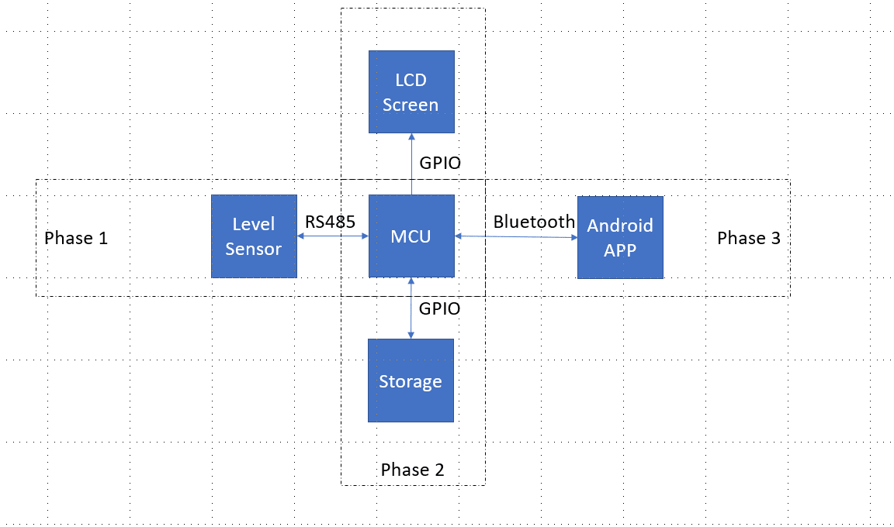
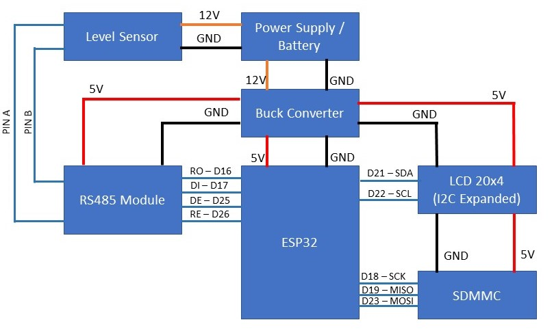

# Level Sensor Magnetostrictive Probe (SYW_A) - Using ESP32

## INTRODUCTION
This is a program written in C++ language for ESP32 Arduino core framework.

This program uses a level sensor Magnetostrictive Probe (SYW_A) connected via
modbus for its readout and converts the raw data to human readable format. This
data can be used for various purposes using a readout values of liquid levels.

In this application, we are using the data to show it on LCD screen as well as
streaming it to bluetooth so it can be accessible via an app. Also, the ESP32 is
logging this data on a micro SD memory card as well.

- See [Datasheet](Sensor_Datasheet.pdf)



---

## DEPENDENCIES

Following are the required components needed for this application:

- ✔️ ESP32 Dev Kit
- ✔️ Magnetostrictive Probe (SYW_A)
- ✔️ RS485 Module
- ✔️ LCD 20x4 I2C
- ✔️ SDMMC module
- ✔️ Buck converter

According to data sheet sensor works on 24 to 26VDC power supply, while the buck
converter will be used for powering rest of the components and can take input
voltage from 9V to 36V. So the power supply can be common for both senor and
buck convertor module

Note: The sensor also output data on 12V DC power supply.

---

## INSTALLATIONS

Arduino IDE is required along with ESP32 board installed on it. Use following
method to install ESP32 board:

- Step 1: Enter following link into File > Preferences > Additional Boards
Manager URL
```
https://dl.espressif.com/dl/package_esp32_index.json
```
- Step 2: Go To Tools > Board > Board Manager. Search for ESP32 and install it.
- Step 3: Select ESP32 Dev Module from Tools > Board > ESP32 Arduino.
- Step 4: Select COMM port from Tools > Port.
- Step 5: Compile and Upload.

---

## HARDWARE / CONNECTIONS

Connect the devices/modules as per following connection table:

| S. No. | ESP32 PIN | DEVICE PIN |
|:-------|:----------|:-----------|
| 1 | D16 | RS485 RO | 
| 2 | D17 | RS485 DI |
| 3 | D25 | RS485 DE |
| 4 | D26 | RS485 RE |
| 5 | D21 | LCD SDA |
| 6 | D22 | LCS SCL |
| 7 | D18 | SDMMC SCK |
| 8 | D19 | SDMMC MISO |
| 9 | D23 | SDMMC MOSI |

Power connections are as follows:

| S. No. | PIN | PIN |
|:-------|:----|:----|
| 1 | ESP32 5V/VIN | BUCK OUT + |
| 2 | ESP32 GND | BUCK OUT - |
| 3 | RS485 VCC | BUCK OUT + |
| 4 | RS485 GND | BUCK OUT - |
| 5 | LCD VCC | BUCK OUT + |
| 6 | LCD GND | BUCK OUT - |
| 7 | SDMMC VCC | BUCK OUT + |
| 8 | SDMMC GND | BUCK OUT - |

Follow the diagram for more intuitive idea.
- See [Connection Table](Connection_Table.pdf)



---

## USAGE

Just simply upload the program using Arduino IDE.

## TESTING

- ✔️ Sensor
- ✔️ LCD
- ❌ Logging
- ❌ Bluetooth Stream

## TODO

- ✔️ Modbus sensor readout library
- ✔️ LCD interface
- ❌ Data logging
- ❌ Bluetooth Stream
